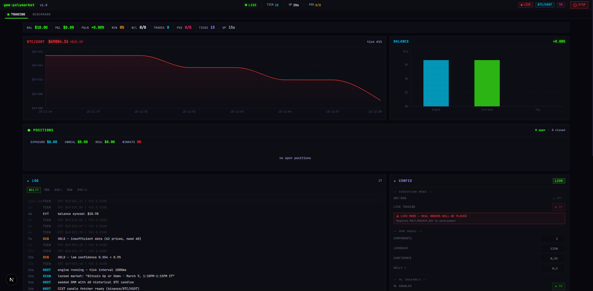

# NeoTerm UI

A terminal-inspired UI component library for Next.js — CRT aesthetics, neon accents, and monospace typography.



## Install

```bash
npm install neoterm-ui
```

## Setup

Import the base styles in your layout or global CSS:

```ts
import "neoterm-ui/styles";
```

Then use any component:

```tsx
import { TerminalBox, GlowText, KpiCard } from "neoterm-ui";
```

## Components

**Layout & Containers** — `TerminalBox`, `Modal`, `Drawer`, `CodeBlock`, `CommandLine`

**Data Visualization** — `KpiCard`, `Sparkline`, `HeatMap`, `MiniBarChart`, `Donut`, `Gauge`, `LogViewer`, `Timeline`

**Neon & Glow Effects** — `GlowText`, `GlowBox`, `NeonLine`, `RippleButton`

**Animation** — `AnimateIn`, `Stagger`, `Typewriter`, `CountUp`

**Status & Feedback** — `Alert`, `Callout`, `Toast`, `StatusDot`, `StatusBadge`, `ProgressBar`

**Navigation** — `CommandPalette`, `Breadcrumb`, `Stepper`, `Dropdown`, `NotificationBell`

**Form Controls** — `Textarea`, `Select`, `Checkbox`, `ToggleGroup`, `Switch`, `Slider`

**Decorative** — `MatrixRain`, `GridPattern`, `DotGrid`, `ScanlineOverlay`, `NoiseOverlay`, `GradientText`, `PulseRing`

**Misc** — `Avatar`, `AvatarGroup`, `Tag`, `TagGroup`, `Kbd`, `Truncate`, `Mono`, `EmptyState`, `Divider`, `Spinner`

## Hooks

- `useMediaQuery` — responsive breakpoint detection
- `useCopyToClipboard` — clipboard interaction
- `useHotkey` — keyboard shortcut binding
- `useToggle` — boolean state toggle

## Utilities

```ts
import { cn, formatUsd, formatPct, formatDuration, timeAgo } from "neoterm-ui";
```

## Tech Stack

- React 19 + Next.js 16
- TypeScript
- Tailwind CSS 4
- Radix UI primitives
- Recharts
- Motion (Framer Motion)

## Development

```bash
npm run dev          # dev server on :4000
npm run build        # compile library
npm run build:next   # build Next.js demo app
npm run typecheck    # strict type-check
npm run lint         # lint
```

## License

MIT
